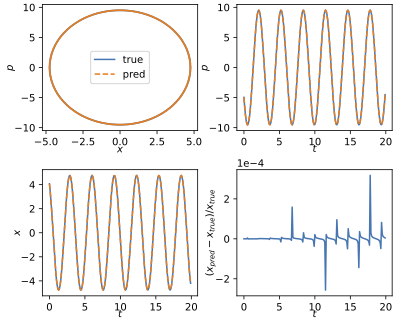
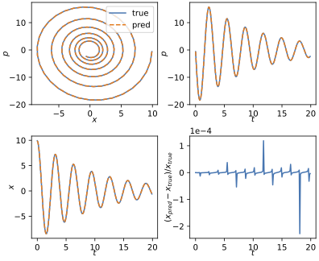

# Transformer model for harmonic oscillator 
This is a work in progress project. The goal here is to study if transformers can learn physics. We attempt this by training a transformer model to learn the dynamics of the simple Harmonic oscillator.  

The classical harmonic oscillator is a mass $m$ attached to a spring with a spring constant $k$ with the equation of motion $\ddot x + 2\gamma \dot x  + \omega^2 x = 0$, where $x$ is the position, and $\omega = \sqrt{k/m}$ is the natural frequency of the oscillator and $\gamma$ is the damping parameter. We use the mass $m = 1$, and focus on the underdamped case with $\omega > \gamma$.  The model is trained on multiple trajectories each defined as a sequence $\{(x_0, p_0), (x_1, p_1), \dots (x_t, p_t) \}$, where $x_i$ and $p_i$ are the position and momentum at the $i$-th time step and is asked to present the next $(x_{t+1}, p_{t+1})$. For validation, we generate a full trajectory. That is, we start by the time series $\{(x_0, p_0), x_1, p_1), \dots (x_t, p_t) \}$ predict $(x_{t+1}, p_{t+1})$, then using the predicted values we feed $\{(x_1, p_1), (x_1, p_1), \dots (x_{t+1}, p_{t+1}) \}$ back to the model to get $(x_{t+2}, p_{t+2})$, and so on. 

# Fixed $\omega$ and $\gamma$ results
The simplest task is to fix $\omega$ for training and validation. This leaves the initial energy of the system $E = \frac{1}{2} m \dot x_0^2 + \frac{1}{2} k x_0^2 $ as the only variable to distinguish different trajectories. 
In this case we find that the model trains and generalizes very well even for very small models. 
We train a model that has a single layer attention-only transformer model with no layer norm. 
The input of the model is a single initial point in the phase space $\boldsymbol X = \{x_0, p_0\} $, and the output is the next point in the trajectory after $\Delta t$ time has passed, $\boldsymbol Y = \{x_1, p_1\}. $

### The model: 
In the following example we work with $m = 1$, $\omega = 2$, and $dt = 0.1$. The model simply reads 
$$ \boldsymbol X \rightarrow \tilde{\boldsymbol X }= W_E X $$ 
$$\tilde X  \rightarrow \tilde Y = \tilde X + h(\tilde X) $$ 
$$ \tilde{\boldsymbol Y}  \rightarrow Y  = W_{U} \tilde{\boldsymbol Y}$$
Where $W_E$, and $W_U$ are the embedding and unembedding matrices, and $h(\tilde{\boldsymbol X})$ is the attention layer output added to the residual stream. Here we use a the residual stream dimension to be $d_{\text{mode}l} = 2$ with one attention head. 
We perform the training for trajectories with $x_0 \in [0,1]$ and $p_0 \in [0,1]$, and perform validation for trajectories seen and unseen during training to test how the model generalize.  

Here's an example for the results testing on a trajectory outside the range seen on training: 

As can be seen the model generalizes nicely in this case. 

# Learning $\omega$ and $\gamma$

We can also try to train the model using variable $\omega$ and $\gamma$ and hope that the model learns this parameter as part of training. This is still a work in progress. 